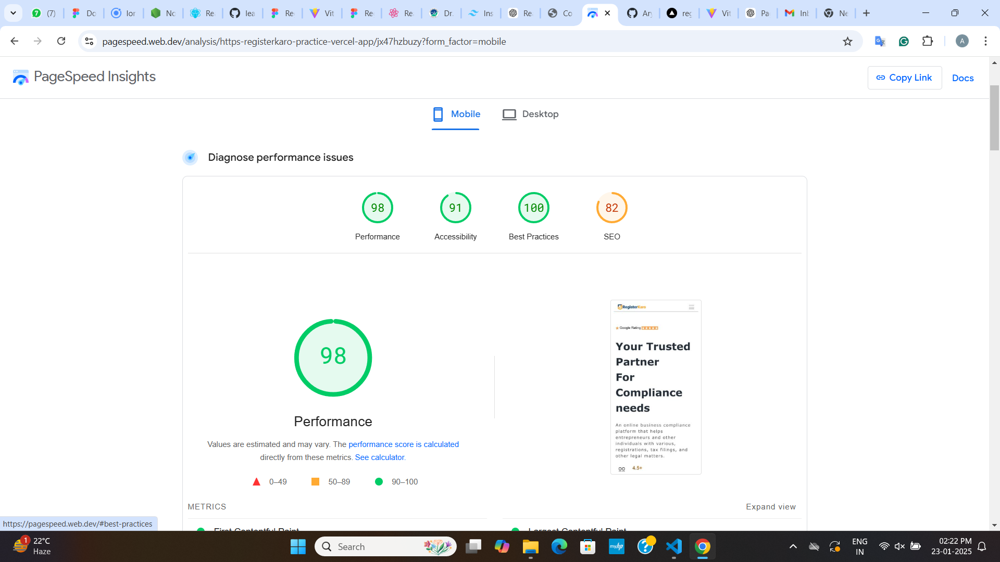
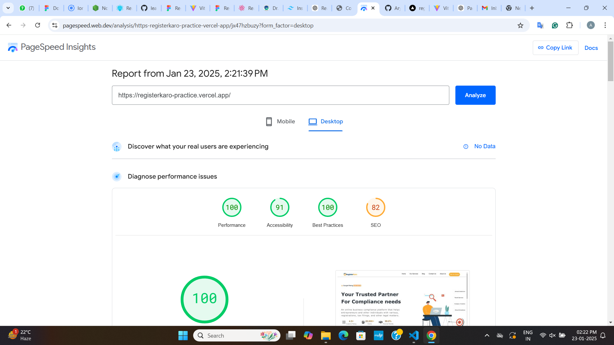

# Frontend Developer Assessment

This repository contains the solution to the Frontend Developer Assessment task. The project involves creating a responsive homepage design using React, as per the provided Figma design, and ensuring high performance with a PageSpeed Insights score of 90+ on both mobile and desktop.


## Technologies Used
- **React (Latest Version)**
- **CSS Modules/Tailwind CSS** (specify which you used)
- **Vercel** (for deployment)

---

## Live Demo
The project has been deployed on Vercel. You can access it via the link below:  
[Live Demo Link](#) (Replace `#` with the actual Vercel URL)

---

## Features
- Fully responsive design optimized for all devices (mobile, tablet, desktop).
- Follows the Figma design closely with pixel-perfect accuracy.
- Performance optimized to achieve a 90+ score on Google PageSpeed Insights.
- Modular and clean code structure for scalability and readability.

---

## Performance Scores
The project achieves the following PageSpeed Insights scores:

### Mobile


### Desktop


The screenshots are located in the `performance-screenshots` folder within this repository.

---

## Setup and Installation
To run the project locally, follow these steps:

1. Clone the repository:
   ```bash
   git clone [repository link]
